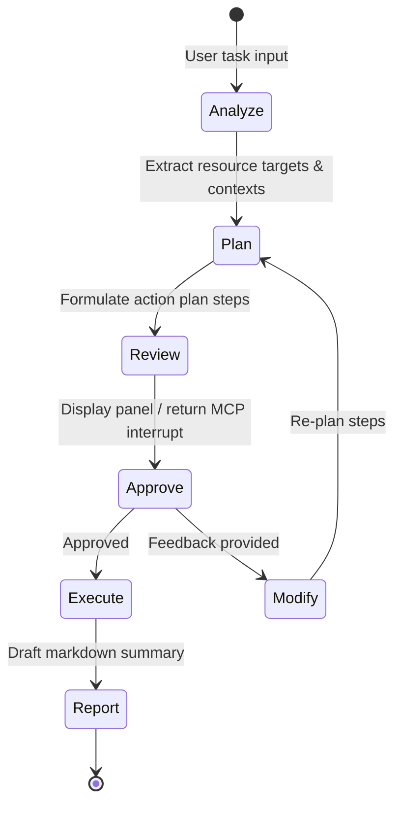

# Architectural Overview

OpsAgents uses a modular, layered architecture that centers around LangGraph state machines and the Model Context Protocol.

## System Workflow
The lifecycle of an agent execution is modeled as a state diagram:

## Shared Core Components
- **BaseAgent (`core/base_agent.py`)**: Abstract base parent class implementing the standard LangGraph node loop and interrupts.
- **LLM Provider (`core/llm_provider.py`)**: Connects to multi-provider ChatModels (OpenAI, Anthropic, Bedrock, Ollama).
- **Approval System (`core/approval.py`)**: Handles CLI and MCP confirmation prompts.
- **State Definitions (`core/state.py`)**: Defines Pydantic/TypedDict state boundaries.
