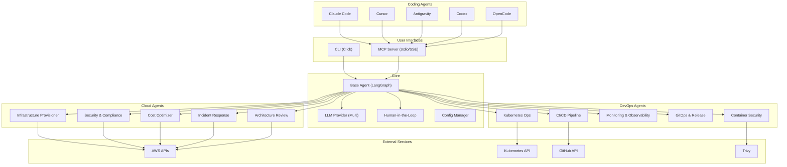
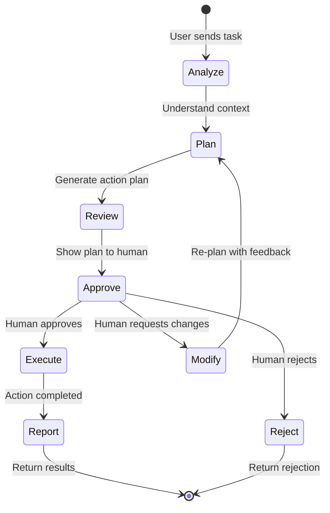

# OpsAgents — Cloud & DevOps AI Agents

Production-ready suite of 10 AI agents (5 Cloud + 5 DevOps) that assist cloud/DevOps engineers in their daily work, built with LangGraph and Python.

## Summary of Design Decisions

| Decision | Choice |
|---|---|
| Language | Python 3.11+ |
| Agent Framework | LangGraph |
| LLM Providers | Multi-provider (OpenAI, Anthropic, Google, AWS Bedrock, Azure OpenAI, Ollama) |
| Cloud Platform | AWS |
| IaC Tools | Terraform + CloudFormation |
| CI/CD Platform | GitHub Actions |
| Interface | CLI + MCP Server |
| Human-in-the-Loop | Interactive CLI prompts + MCP confirmation requests |
| Project Structure | Monorepo with shared core |
| Package Manager | uv |
| Testing/Quality | pytest + ruff + mypy |
| Configuration | YAML config + environment variables |
| Python min version | 3.11+ |

---

## Proposed Changes

### 1. Project Root Structure

```
cloud-devops-agents/
├── pyproject.toml                  # Root package config (uv workspace)
├── uv.lock                        # Lockfile
├── README.md                      # Main README with badges, architecture, quickstart
├── LICENSE                        # Apache 2.0
├── CONTRIBUTING.md                # Contribution guidelines
├── CHANGELOG.md                   # Version changelog
├── Makefile                       # Dev convenience commands
├── Dockerfile                     # Multi-stage Docker build
├── docker-compose.yml             # Run agents via Docker
├── .github/
│   └── workflows/
│       ├── ci.yml                 # Lint + test + type-check on PR
│       └── release.yml            # Build + publish on tag
├── .gitignore
├── .env.example                   # Example environment variables
├── config.example.yml             # Example agent configuration
├── src/
│   └── opsagents/                 # Main package
│       ├── __init__.py
│       ├── __main__.py            # Entry point: `python -m opsagents`
│       ├── cli.py                 # Click-based CLI router
│       ├── config.py              # YAML + env var config loader
│       ├── core/                  # Shared core library
│       ├── cloud/                 # 5 Cloud agents
│       ├── devops/                # 5 DevOps agents
│       └── mcp/                   # MCP server implementation
├── tests/                         # Test suite
├── docs/                          # Detailed documentation
└── examples/                      # Usage examples
```

---

### 2. Core Library (`src/opsagents/core/`)

The shared foundation all 10 agents build upon.

#### [NEW] `src/opsagents/core/__init__.py`
Package init.

#### [NEW] `src/opsagents/core/base_agent.py`
Abstract base agent class using LangGraph `StateGraph`:
- Common state schema (messages, context, approval_needed, action_plan)
- Standard node structure: `analyze → plan → human_approval → execute → report`
- Built-in human-in-the-loop interrupt mechanism using LangGraph's `interrupt()` 
- Configurable approval policies (auto-approve read-only, require approval for mutations)
- Streaming support for real-time output
- Error handling and retry logic

#### [NEW] `src/opsagents/core/llm_provider.py`
Multi-provider LLM abstraction:
- Factory pattern: `get_llm(provider, model, **kwargs)` 
- Supported providers: OpenAI, Anthropic, Google, Bedrock, Azure OpenAI, Ollama
- Uses `langchain-openai`, `langchain-anthropic`, `langchain-google-genai`, `langchain-aws`, `langchain-ollama`
- Automatic fallback if primary provider fails
- Token usage tracking and cost estimation

#### [NEW] `src/opsagents/core/tools.py`
Base tool utilities:
- `@safe_tool` decorator that wraps tool execution with error handling
- Tool result formatting (structured output for LLM consumption)
- Common tool patterns (file read/write, command execution, API calls)

#### [NEW] `src/opsagents/core/approval.py`
Human-in-the-loop approval system:
- `ApprovalRequest` dataclass (action, risk_level, details, options)
- `CLIApprovalHandler` — Rich-formatted terminal prompts with colored risk indicators
- `MCPApprovalHandler` — Returns structured approval request to coding agent
- Risk level classification: `LOW` (auto-approve), `MEDIUM` (warn + approve), `HIGH` (require explicit approval), `CRITICAL` (require typed confirmation)
- Approval audit logging

#### [NEW] `src/opsagents/core/state.py`
Shared LangGraph state definitions:
- `AgentState(TypedDict)` with messages, context, actions, approvals
- State serialization for checkpointing

#### [NEW] `src/opsagents/core/output.py`
Rich console output formatting:
- Colored status indicators, progress bars, tables
- Markdown rendering for reports
- Structured output for MCP responses

---

### 3. Cloud Agents (`src/opsagents/cloud/`)

#### [NEW] `src/opsagents/cloud/__init__.py`

#### [NEW] `src/opsagents/cloud/infrastructure/`
**Infrastructure Provisioner Agent**
- `agent.py` — LangGraph state graph: analyze requirements → generate IaC → validate → plan → **human approval** → apply
- `tools.py` — Tools:
  - `terraform_init`, `terraform_plan`, `terraform_apply`, `terraform_destroy`
  - `cfn_validate`, `cfn_create_stack`, `cfn_update_stack`, `cfn_delete_stack`
  - `generate_terraform_code` — LLM generates HCL from natural language
  - `generate_cfn_template` — LLM generates CloudFormation YAML
  - `estimate_cost` — Uses AWS Pricing API / Infracost
  - `detect_drift` — Compares actual state vs desired state
- `prompts.py` — System prompts and few-shot examples for IaC generation

#### [NEW] `src/opsagents/cloud/security/`
**Security & Compliance Agent**
- `agent.py` — LangGraph: scan → analyze findings → prioritize → **human approval** → remediate
- `tools.py` — Tools:
  - `scan_iam_policies` — Analyze IAM policies for overly permissive access
  - `scan_security_groups` — Check for open ports, unrestricted ingress
  - `scan_s3_buckets` — Check public access, encryption, versioning
  - `scan_cloudtrail` — Analyze audit logs for suspicious activity
  - `check_cis_benchmark` — Validate against CIS AWS Foundations Benchmark
  - `generate_compliance_report` — Generate PDF/Markdown compliance report
  - `remediate_finding` — Apply fix for a specific finding
- `prompts.py` — Security analysis system prompts

#### [NEW] `src/opsagents/cloud/cost/`
**Cost Optimizer Agent**
- `agent.py` — LangGraph: collect usage → analyze → recommend → **human approval** → execute savings
- `tools.py` — Tools:
  - `get_cost_breakdown` — AWS Cost Explorer API for spend analysis
  - `find_unused_resources` — Detect unattached EBS, idle EC2, unused EIPs
  - `recommend_rightsizing` — AWS Compute Optimizer integration
  - `analyze_reserved_instances` — RI/Savings Plans recommendations
  - `generate_cost_report` — Spending trends, projections, anomalies
  - `terminate_resource` — Remove unused resource (with approval)
- `prompts.py` — Cost analysis system prompts

#### [NEW] `src/opsagents/cloud/incident/`
**Incident Response Agent**
- `agent.py` — LangGraph: detect → investigate → diagnose → **human approval** → remediate → post-mortem
- `tools.py` — Tools:
  - `get_active_alarms` — CloudWatch alarms in ALARM state
  - `query_logs` — CloudWatch Logs Insights queries
  - `analyze_metrics` — CloudWatch metric analysis
  - `get_recent_changes` — CloudTrail events for recent changes
  - `execute_runbook` — Run predefined remediation steps
  - `generate_postmortem` — Create incident post-mortem report
- `prompts.py` — Incident analysis system prompts

#### [NEW] `src/opsagents/cloud/architecture/`
**Architecture Review Agent**
- `agent.py` — LangGraph: discover resources → analyze architecture → evaluate pillars → **present findings** → generate report
- `tools.py` — Tools:
  - `discover_resources` — AWS Resource Groups / Config for resource inventory
  - `analyze_architecture` — Evaluate against Well-Architected pillars
  - `check_reliability` — Multi-AZ, backup, failover analysis
  - `check_performance` — Scaling, caching, CDN analysis
  - `check_security` — Encryption, access control, network segmentation
  - `check_cost` — Tagging, right-sizing, reserved capacity
  - `check_operational_excellence` — Monitoring, automation, runbooks
  - `generate_architecture_diagram` — Create architecture diagrams (Mermaid/Diagrams-as-code)
  - `generate_review_report` — Full Well-Architected review report
- `prompts.py` — Architecture review system prompts

---

### 4. DevOps Agents (`src/opsagents/devops/`)

#### [NEW] `src/opsagents/devops/__init__.py`

#### [NEW] `src/opsagents/devops/cicd/`
**CI/CD Pipeline Agent**
- `agent.py` — LangGraph: analyze repo → generate/debug pipeline → validate → **human approval** → apply
- `tools.py` — Tools:
  - `analyze_repository` — Detect language, framework, build system
  - `generate_github_actions` — Create GitHub Actions workflow YAML
  - `debug_pipeline_failure` — Analyze failed workflow runs via GitHub API
  - `optimize_pipeline` — Caching, parallelization, job dependency optimization
  - `validate_workflow` — Syntax and semantic validation
  - `list_workflow_runs` — Recent runs, status, duration
- `prompts.py` — CI/CD system prompts

#### [NEW] `src/opsagents/devops/kubernetes/`
**Kubernetes Operations Agent**
- `agent.py` — LangGraph: assess cluster → analyze issue → generate manifests → **human approval** → apply
- `tools.py` — Tools:
  - `get_cluster_status` — Node, pod, service health summary
  - `troubleshoot_pod` — Analyze CrashLoopBackOff, OOMKilled, pending pods
  - `generate_manifest` — Create K8s YAML from natural language
  - `generate_helm_chart` — Scaffold Helm chart
  - `scale_deployment` — Scale replicas up/down
  - `get_pod_logs` — Fetch and analyze pod logs
  - `rollback_deployment` — Rollback to previous revision
  - `analyze_resource_usage` — CPU/memory requests vs actual usage
- `prompts.py` — Kubernetes system prompts

#### [NEW] `src/opsagents/devops/monitoring/`
**Monitoring & Observability Agent**
- `agent.py` — LangGraph: assess monitoring → identify gaps → generate configs → **human approval** → apply
- `tools.py` — Tools:
  - `setup_prometheus_rules` — Generate Prometheus alerting/recording rules
  - `create_grafana_dashboard` — Generate Grafana dashboard JSON
  - `setup_cloudwatch_alarms` — Create CloudWatch alarm configurations
  - `define_slo` — Create SLO/SLI definitions
  - `analyze_metrics_patterns` — Detect anomalies, trends in metrics
  - `generate_alerting_config` — Alert routing, silencing, escalation
- `prompts.py` — Monitoring system prompts

#### [NEW] `src/opsagents/devops/gitops/`
**GitOps & Release Agent**
- `agent.py` — LangGraph: analyze release → plan strategy → prepare artifacts → **human approval** → deploy
- `tools.py` — Tools:
  - `setup_argocd_app` — Generate ArgoCD Application manifests
  - `plan_release_strategy` — Blue-green, canary, rolling update planning
  - `generate_changelog` — Auto-generate changelog from commits
  - `manage_version` — Semantic versioning bump
  - `rollback_release` — Initiate rollback procedure
  - `validate_deployment` — Health checks post-deploy
- `prompts.py` — GitOps system prompts

#### [NEW] `src/opsagents/devops/container_security/`
**Container & Image Security Agent**
- `agent.py` — LangGraph: scan image → analyze vulns → prioritize → **human approval** → remediate
- `tools.py` — Tools:
  - `scan_image_trivy` — Run Trivy vulnerability scan
  - `optimize_dockerfile` — Reduce image size, fix security issues
  - `check_base_image_updates` — Check for newer base image versions
  - `generate_image_sbom` — Software Bill of Materials
  - `enforce_signing_policy` — Cosign/Notary image signing
  - `scan_supply_chain` — Check dependencies for known vulnerabilities
- `prompts.py` — Container security system prompts

---

### 5. CLI Interface (`src/opsagents/cli.py`)

Built with **Click** framework:

```
opsagents [--config config.yml] [--provider openai] [--model gpt-4o] COMMAND

Cloud Commands:
  opsagents infra       Infrastructure Provisioner Agent
  opsagents security    Security & Compliance Agent
  opsagents cost        Cost Optimizer Agent
  opsagents incident    Incident Response Agent
  opsagents architect   Architecture Review Agent

DevOps Commands:
  opsagents cicd        CI/CD Pipeline Agent
  opsagents k8s         Kubernetes Operations Agent
  opsagents monitor     Monitoring & Observability Agent
  opsagents gitops      GitOps & Release Agent
  opsagents container   Container & Image Security Agent

Utility Commands:
  opsagents config      Manage configuration
  opsagents mcp         Start MCP server (for coding agent integration)
  opsagents version     Show version info
```

Each agent command accepts a natural language task:
```bash
opsagents infra "Create a VPC with 3 public and 3 private subnets in us-east-1"
opsagents security "Scan all S3 buckets for public access and missing encryption"
opsagents cost "Find all unused resources in the production account"
```

---

### 6. MCP Server (`src/opsagents/mcp/`)

#### [NEW] `src/opsagents/mcp/__init__.py`

#### [NEW] `src/opsagents/mcp/server.py`
MCP server using `mcp` Python SDK (FastMCP):
- Registers all 10 agents as MCP tools
- Each tool accepts a natural language task string + optional parameters
- Returns structured results with approval requests when needed
- Supports `stdio` transport (for Claude Code, Cursor, Antigravity)
- Supports `SSE` transport (for web-based clients)

#### MCP Configuration for coding agents:

**Claude Code / Antigravity** (`.mcp.json`):
```json
{
  "mcpServers": {
    "opsagents": {
      "command": "uv",
      "args": ["run", "opsagents", "mcp"],
      "env": {
        "OPENAI_API_KEY": "...",
        "AWS_PROFILE": "production"
      }
    }
  }
}
```

**Cursor** (MCP settings):
```json
{
  "mcpServers": {
    "opsagents": {
      "command": "opsagents",
      "args": ["mcp"],
      "transport": "stdio"
    }
  }
}
```

---

### 7. Configuration (`config.example.yml`)

```yaml
# OpsAgents Configuration
llm:
  provider: openai          # openai | anthropic | google | bedrock | azure | ollama
  model: gpt-4o             # Model name
  temperature: 0.1
  max_tokens: 4096
  fallback_provider: anthropic
  fallback_model: claude-sonnet-4-20250514

approval:
  default_policy: prompt     # auto | prompt | strict
  risk_levels:
    low: auto                # Auto-approve low-risk actions (read-only)
    medium: prompt           # Prompt for medium-risk (modifications)
    high: prompt             # Prompt with details for high-risk
    critical: confirm        # Require typed confirmation for critical

aws:
  profile: default
  region: us-east-1

logging:
  level: INFO
  file: ~/.opsagents/logs/agent.log
  audit_trail: true          # Log all approved/denied actions
```

---

### 8. Documentation (`docs/`)

#### [NEW] `docs/index.md` — Documentation home
#### [NEW] `docs/getting-started.md` — Installation, setup, first run
#### [NEW] `docs/configuration.md` — Full config reference
#### [NEW] `docs/architecture.md` — System architecture, agent lifecycle
#### [NEW] `docs/mcp-integration.md` — Setting up with Claude Code, Cursor, Antigravity, Codex, OpenCode
#### [NEW] `docs/agents/` — One detailed doc per agent:
- `docs/agents/infrastructure-provisioner.md`
- `docs/agents/security-compliance.md`
- `docs/agents/cost-optimizer.md`
- `docs/agents/incident-response.md`
- `docs/agents/architecture-review.md`
- `docs/agents/cicd-pipeline.md`
- `docs/agents/kubernetes-ops.md`
- `docs/agents/monitoring-observability.md`
- `docs/agents/gitops-release.md`
- `docs/agents/container-security.md`

---

### 9. Examples (`examples/`)

#### [NEW] `examples/basic_usage.py` — Simple agent invocation
#### [NEW] `examples/custom_config.yml` — Custom configuration example
#### [NEW] `examples/multi_provider.py` — Switching between LLM providers
#### [NEW] `examples/mcp_setup/` — MCP config files for each coding agent

---

### 10. Tests (`tests/`)

#### [NEW] `tests/conftest.py` — Shared fixtures, mock LLM providers
#### [NEW] `tests/core/` — Tests for base agent, LLM provider, approval system
#### [NEW] `tests/cloud/` — Tests for each cloud agent (mocked AWS calls)
#### [NEW] `tests/devops/` — Tests for each DevOps agent (mocked tool calls)
#### [NEW] `tests/mcp/` — MCP server integration tests
#### [NEW] `tests/cli/` — CLI command tests

---

### 11. Docker Support

#### [NEW] `Dockerfile`
Multi-stage build:
- Stage 1: Install uv + dependencies
- Stage 2: Copy source, install package
- Runs as non-root user
- Exposes MCP SSE port (optional)

#### [NEW] `docker-compose.yml`
```yaml
services:
  opsagents:
    build: .
    env_file: .env
    volumes:
      - ./config.yml:/app/config.yml
      - ~/.aws:/home/opsagents/.aws:ro
```

---

### 12. GitHub CI/CD (`.github/workflows/`)

#### [NEW] `.github/workflows/ci.yml`
On PR:
- Lint with ruff
- Type check with mypy
- Run tests with pytest
- Check formatting

#### [NEW] `.github/workflows/release.yml`
On tag push:
- Build package
- Publish to PyPI (optional)
- Build and push Docker image

---

### 13. Key Dependencies

```toml
[project]
name = "opsagents"
requires-python = ">=3.11"

[project.dependencies]
langgraph = ">=0.4"
langchain-core = ">=0.3"
langchain-openai = ">=0.3"
langchain-anthropic = ">=0.3"
langchain-google-genai = ">=2.1"
langchain-aws = ">=0.2"
langchain-ollama = ">=0.3"
mcp = ">=1.9"
click = ">=8.1"
rich = ">=13.0"
pyyaml = ">=6.0"
pydantic = ">=2.0"
boto3 = ">=1.35"
kubernetes = ">=31.0"
httpx = ">=0.28"

[project.optional-dependencies]
dev = [
    "pytest>=8.0",
    "pytest-asyncio>=0.25",
    "ruff>=0.9",
    "mypy>=1.14",
    "pytest-cov>=6.0",
]
```

---

## Architecture Diagram



---

## Agent Lifecycle (Human-in-the-Loop Flow)



---

## Execution Order

I'll build this in the following order to ensure dependencies are resolved:

1. **Phase 1 — Foundation**: Project scaffolding, `pyproject.toml`, config, core library
2. **Phase 2 — Cloud Agents**: All 5 cloud agents with tools and prompts
3. **Phase 3 — DevOps Agents**: All 5 DevOps agents with tools and prompts
4. **Phase 4 — Interfaces**: CLI router and MCP server
5. **Phase 5 — Quality**: Tests, linting config, type checking
6. **Phase 6 — Repo Polish**: README, docs, examples, Docker, CI/CD, LICENSE, CONTRIBUTING, CHANGELOG

---

## Verification Plan

### Automated Tests
```bash
# Lint
uv run ruff check src/ tests/

# Type check
uv run mypy src/opsagents/

# Unit tests
uv run pytest tests/ -v --cov=opsagents

# Format check
uv run ruff format --check src/ tests/
```

### Manual Verification
- Run each agent in CLI mode with a sample task and verify human-in-the-loop prompts work
- Start MCP server and verify tool registration
- Build Docker image and verify it runs
- Verify README renders correctly on GitHub
